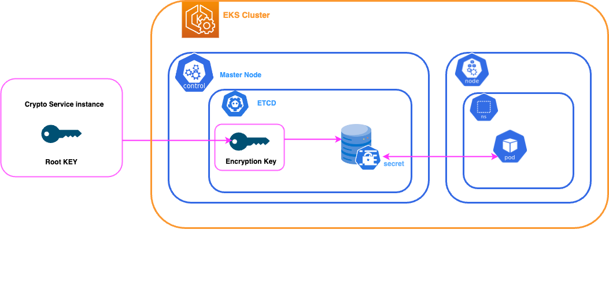

# Securing SonarQube Deployments: Encrypting JDBC Passwords in Kubernetes Secrets

SonarQube is a powerful tool for continuous code quality inspection. However, ensuring the security of sensitive information such as JDBC passwords is crucial when deploying SonarQube in production environments. In this guide, we'll walk through the process of securely encrypting JDBC passwords and storing them in Kubernetes secrets to enhance the security of your SonarQube deployment.

## Use Case Scenario:
Our customer, let's call them CompanyX, has a robust infrastructure running on Kubernetes. They utilize PostgreSQL for their database needs and have implemented best practices for securing their deployments.He already has an encryption key that he uses for his passwords stored in a Kubernetes secret. Now, CompanyX aims to integrate SonarQube into their workflow to enhance code quality analysis. However, they prioritize security and want to ensure that sensitive data, such as database passwords, remains protected.



## Prerequisites

In this tutorial, we'll leverage an existing AWS EKS server for Kubernetes deployment. Additionally, we'll utilize AWS SDK in Go to provision a basic instance of PostgreSQL. However, it's not mandatory to follow this step if you already have your Kubernetes server deployed. We'll also provide scripts for deploying your own database instance, ensuring flexibility in your setup.

Why use the AWS SDK in go ? Because i already had a PostgreSQL deployment module used in another project, so I utilized it. We could have employed it to deploy the entire database and SonarQube DCE, but I wanted to demonstrate the addition of a Helm template.

If you have the prerequisites such as a Kubernetes server, a database instance, and Helm installed, you can skip directly to the SonarQube deployment section.

Before you get started, you’ll need to have these things:

* AWS account
* [AWS Development Kit (AWS SDK) v2](https://aws.github.io/aws-sdk-go-v2/docs/getting-started/)
* [Go language installed](https://go.dev/)
* [Kubectl installed](https://docs.aws.amazon.com/eks/latest/userguide/install-kubectl.html) is a command line tool that you use to communicate with the Kubernetes API 
server.
* [HELM](https://helm.sh/docs/intro/install/) The package manager for kubernetes
* bash version 4+
* A Git Client
* AWS EKS cluster installed
* [JQ](https://jqlang.github.io/jq/) The command-line JSON processor

---

## Steps


### ✅ Clone the repositories

```bash
:> git clone https://github.com/emmanuel-colussi-sonarsource/k8s-helm-sq-key k8s-helm-sq-key
:> cd k8s-helm-sq-key
```

### ✅ Database deployment
go to directory [db](db) (please read the README.md)

### ✅ Generated an AES/GCM key and created kubernetes secrets
go to directory [key](key) (please read the README.md)

### ✅ SonarQube deployment
go to directory [sonarqube](sonarqube) (please read the README.md)

---

✅ Conclusion

Deploying SonarQube securely on Kubernetes with external encrypted keys for database connection credentials is crucial for maintaining the integrity and confidentiality of sensitive information. By following best practices such as utilizing Kubernetes secrets and generating encryption keys with specific characteristics, organizations can enhance the security posture of their SonarQube deployments. 

In addition to the methods discussed, such as storing encryption keys in Kubernetes secrets, organizations have alternative approaches to manage encryption keys securely. One notable method involves integrating external key management services like AWS Secrets Manager with Kubernetes. By leveraging such services, encryption keys can be managed outside the cluster environment, providing an additional layer of isolation and security. Similarly, utilizing Key Management Service (KMS) providers tailored to specific cloud platforms or security requirements offers another avenue for robust key management. 

These approaches enable organizations to centralize key management, adhere to compliance requirements, and mitigate risks associated with unauthorized access to sensitive information. 
Ultimately, the choice of key management method should align with the organization's security policies, regulatory obligations, and operational needs to ensure comprehensive protection of encrypted data in SonarQube and other applications deployed on Kubernetes.

---

## ✅ Clean Up resources

For clean up resources please run this command :
```bash
k8s-helm-sq-key:> ./resetws.sh
✅ Delete namespace sonarqube
namespace "sonarqube" deleted
✅ Delete namespace databasepg
namespace "databasepg" deleted

k8s-helm-sq-key:> 
```
If you want to uninstall one particular component, you have in each step the instruction .

---

## ✅ Ressources

▶️ [SonarQube security](https://docs.sonarsource.com/sonarqube/latest/instance-administration/security/)

▶️ [SonarQube source code encrypt/decrypt](https://github.com/SonarSource/sonarqube/blob/master/sonar-plugin-api-impl/src/main/java/org/sonar/api/config/internal/AesGCMCipher.java#L42)

▶️ [K8s Encrypting Confidential Data](https://kubernetes.io/docs/tasks/administer-cluster/encrypt-data/)