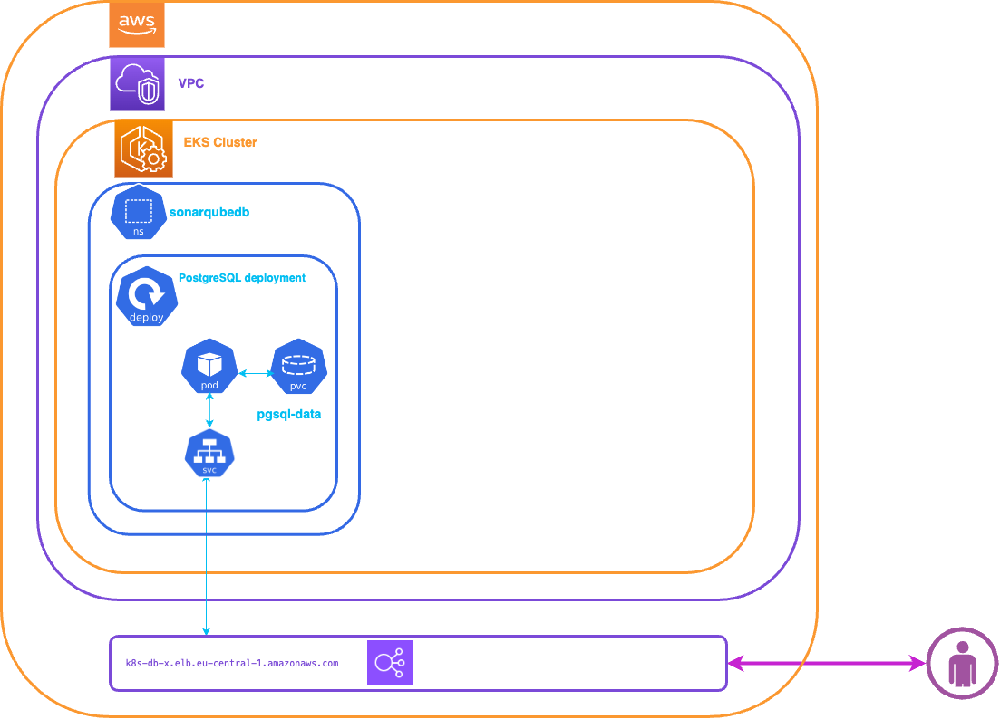

 


# Welcome to your PostgreSQL database Deployment with Go.

The purpose of this deployment is to deploy PostgreSQL Database in EKS Cluster.




* The `config.json` Contains the parameters to be initialized to deploy the task :
```
Config.json :

ClusterName:    EKS Cluster Name
NSDataBase:     K8s Namespace for PostgreSQL database (databasepg)
PvcDBsize:      PVC size for Database storage
PGSecret:       K8s manifest file for database secret (dist/pgsecret.yaml)
StorageClass:   Name of k8s storage class (managed-csi)
Sonaruser:      Sonarqube DB user (sonarqube)
Sonarpass:      Sonarqube DB user password (Bench123)
PGsql:		      K8s manifest file for deployment PostgreSQL database (dist/pgsql.yaml)
PGconf:      	  K8s manifest file for Configmap PostgreSQL database (dist/pgsal-configmap.yam)
PGsvc:          PostgreSQL k8s service
NSSonar:        Sonarqube namespace
```    


All manifest files required for deployment are in directory: **dist**

Two namespaces will be created:
- sonarqubedb : for postgresql database instance


## Prerequisites

Before you get started, you’ll need to have these things:

✅ An EKS Cluster (or ther kubernetes cluster) runnig and configured

✅ Previous deployment steps are completed

## What does this task do?

- Create a k8s namespace for PostgreSQL database
- Create secret and configmap for PostgreSQL database
- Create a PVC for PostgreSQL database
- Deployment PostgreSQL database

> [!CAUTION] This is a test deployment, we could have used a deployment with a TLS certificate which is recommended in production.

## Useful commands

 * `./cdk.sh deploy`      deploy this stack 
 * `./cdk.sh destroy`     cleaning up stack


## ✅ Setup Environment

Run the following command to automatically install all the required modules based on the go.mod and go.sum files:

```bash
k8s-helm-sq-key:> cd db
k8s-helm-sq-key:/db> go mod download
``` 

## ✅ Deploying SonarQube

Let’s deploy a SonarQube! When you’re ready, run **./cdk.sh deploy**

```bash
k8s-helm-sq-key:/db> ./cdk.sh deploy
Deployment PostgreSQL Database :  Creating namespace... 
✅ Namespace databasepg1 created successfully
Deployment PostgreSQL Database :  Creating PVC... 
✅ PVC Database : pgsql-data created successfully

Deployment PostgreSQL Database :  Creating secret database... 
✅ Database secret created successfully

Deployment PostgreSQL Database :  Creating ConfigMap Init DB... 
✅ PGSQLInit configMaps created successfully

Deployment PostgreSQL Database :  Creating ConfigMap DATA DB... 
✅ PGSQLData configMaps created successfully

Deployment PostgreSQL Database :  Deploy Postgresql deployment... 

✅ PostgreSQL Database Successful deployment External IP: k8s-database-postgres-20070ddde0-8cc1726b907c1328.elb.eu-central-1.amazonaws.com
✅ JDBC URL : jdbc:postgresql://postgres-service.databasepg1.svc.cluster.local:5432/sonarqube?currentSchema=public - IP : 10.100.194.203


``` 

You'll have to wait a few minutes for the External address to be bindered by DNS.It is the step : **DNS resolution for Database service**

We can check if SonarQube is deployed :
```bash 
k8s-helm-sq-key:/db>  kubectl get pods -n databasepg
NAME                        READY   STATUS    RESTARTS   AGE
postgres-784c5f86c9-vtkmx   1/1     Running   0         1m56s

k8s-helm-sq-key:/db>
``` 

We can check if database service running :

```bash 
k8s-helm-sq-key:/db> kubectl get svc -n databasepg
NAME                        TYPE           CLUSTER-IP     EXTERNAL-IP              PORT(S)          AGE
service/postgres-service   LoadBalancer   10.X.X.X       k8s-database-xxxx.com   9000:30621/TCP   3m17s

k8s-helm-sq-key:/db>
```    

       
😀  Now you can connect to the Database instance at the following commande :  

```bash 
 k8s-helm-sq-key:/db> kubectl -n databasepg exec --stdin --tty postgres-784c5f86c9-vtkmx -- /usr/bin/psql -U sonarqube -c "SELECT datname FROM pg_database;"
datname  
-----------
 postgres
 template1
 template0
 sonarqube
(4 rows)

k8s-helm-sq-key:/db>
```   

You can also test your external connection to the database , if you have installed a PostgreSQL client tools at the following commande : 

```bash 
 k8s-helm-sq-key:/db> psql -h k8s-database-xxxx.com -U sonarqube -c "SELECT datname FROM pg_database;"
Password for user sonarqube: 
  datname  
-----------
 postgres
 template1
 template0
 sonarqube
(4 rows)

k8s-helm-sq-key:/db>
```  

> [!CAUTION]
> Note the CLUSTER-IP or  EXTERNAL-IP address of the postgres service you will need it during the SonarQube deployment stage
   
-----
<table>
<tr style="border: 0px transparent">
	<td style="border: 0px transparent"> <a href="../README.md" title="Home">⬅ Previous</a></td><td style="border: 0px transparent"><a href="../key/README.md" title="Generate an Encryption Key">Next ➡</a></td><td style="border: 0px transparent"><a href="../README.md" title="home">🏠</a></td>
</tr>
<tr style="border: 0px transparent">
<td style="border: 0px transparent">Home</td><td style="border: 0px transparent">Generate an Encryption Key</td><td style="border: 0px transparent"></td>
</tr>

</table>
