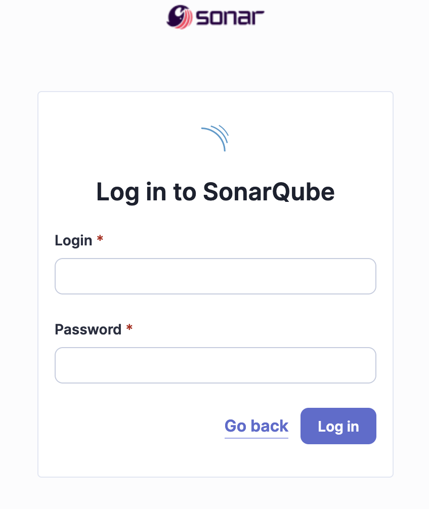

 


# Deploy SonarQube

 

 Our SonarQube deployment will be managed via HELM. In configuring our SonarQube deployment, we will utilize the encrypted PostgreSQL password stored within a Kubernetes secret, as well as the Kubernetes secret housing the encryption key. To facilitate this configuration, we will create a values file containing the following parameters:

- The SonarQube deployer image.
- The name of the Kubernetes secret containing the encryption key to be used.
- Disabling the installation of PostgreSQL.
- JDBC connection details, including:
    - **jdbcUrl**.
    - **jdbcUsername**: "sonarqube".
    - **jdbcSecretName**: The name of the Kubernetes secret containing the password key.
    - **jdbcSecretPasswordKey**: The key within the secret containing the encrypted password value.
    - configuring an AWS loadbalancer service to connect to SonarQube

The Values.yml file used :

```yaml
sonarqube:
 image:
  repository: sonarqube
  tag: sonarqube:10.3.0-enterprise

sonarSecretKey: "sonarsecretkey" 

postgresql:
 enabled: false
 
jdbcOverwrite:
  enable: true 
  jdbcUrl: "jdbc:postgresql://k8s-database-postgres-e93919df7a-6929375e040a7e33.elb.eu-central-1.amazonaws.com:5432/sonarqube?currentSchema=public"
  jdbcUsername: "sonarqube"
  jdbcSecretName: "sonarjdbcpassword"
  jdbcSecretPasswordKey: "SONAR_JDBC_PASSWORD"

service:
  type: LoadBalancer
  externalPort: 9000
  internalPort: 9000
  labels:
  annotations: 
   service.beta.kubernetes.io/aws-load-balancer-scheme: "internet-facing"
   service.beta.kubernetes.io/aws-load-balancer-type: nlb

```

▶️ Install the SonarQube EE Helm Chart with a custom values :

```bash
k8s-helm-sq-key:/key> cd ../sonarqube
k8s-helm-sq-key:/sonarqube> helm repo add sonarqube https://SonarSource.github.io/helm-chart-sonarqube
k8s-helm-sq-key:/sonarqube> helm repo update
k8s-helm-sq-key:/sonarqube> helm upgrade --install -n sonarqube sonarqube sonarqube/sonarqube -f dist/values.yml
Release "sonarqube" does not exist. Installing it now.
NAME: sonarqube
.....

k8s-helm-sq-key:/sonarqube>
```
> [!CAUTION] The helm "**repo add**" and "**helm repo update**" commands only need to be done once to install the helm sonarqube repo.

▶️ We can check if SonarQube is deployed :

```bash
kubectl -n sonarqube1 get all                       
NAME                        READY   STATUS    RESTARTS   AGE
pod/sonarqube-sonarqube-0   1/1     Running   0          92s
```

We can check if SonarQube service running :
```bash
NAME                          TYPE        CLUSTER-IP      EXTERNAL-IP                 PORT(S)    AGE
service/sonarqube-sonarqube   ClusterIP   10.100.63.111   k8s-sonarqub-sonarqub-xxx   9000/TCP   93s
```
 
😀  Now you can connect to the SonarQube instance at the following url sample:  
   
 http://k8s-sonarqub-xxxx.com:9000

 

Default admin credentials
When installing SonarQube, a default user with Administer System permission is created automatically:

* Login: admin
* Password: admin


## Uninstall SonarQube

```bash
k8s-helm-sq-key:/sonarqube> helm -n sonarqube uninstall sonarqube
release "sonarqube" uninstalled
k8s-helm-sq-key:/sonarqube>
```

-----
<table>
<tr style="border: 0px transparent">
	<td style="border: 0px transparent"> <a href="../key/README.md" title="Generate an Encryption Key">⬅ Previous</a></td><td style="border: 0px transparent"><a href="../README.md" title="HOME">Next ➡</a></td><td style="border: 0px transparent"><a href="../README.md" title="home">🏠</a></td>
</tr>
<tr style="border: 0px transparent">
<td style="border: 0px transparent">Generate an Encryption Key</td><td style="border: 0px transparent">HOME</td><td style="border: 0px transparent"></td>
</tr>

</table>